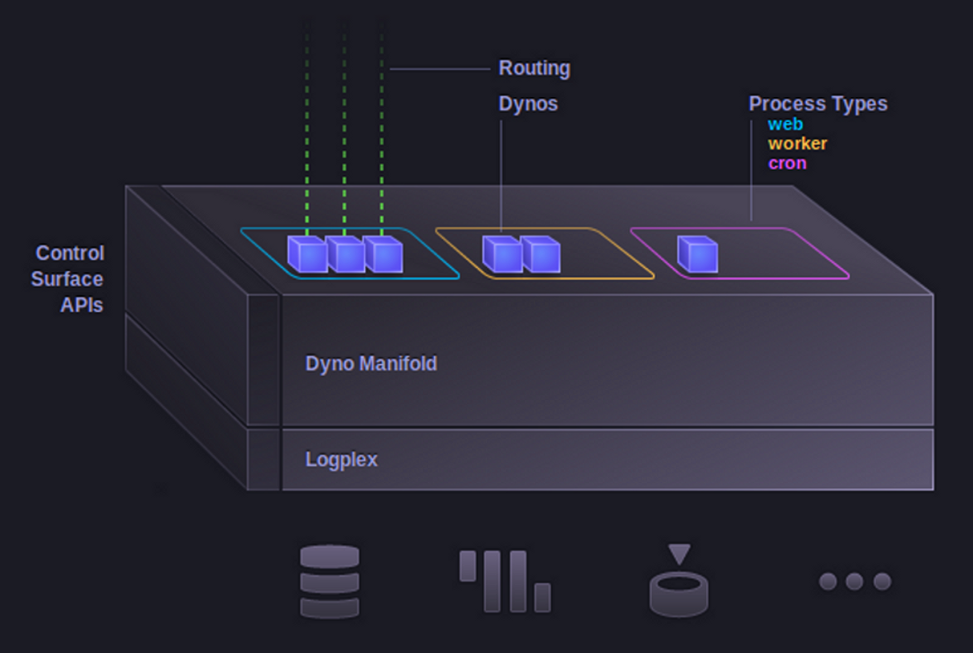

!SLIDE
# Deploying Erlang Applications on Heroku #

### Tristan Sloughter ###
### Erlang Routing Infastructure Engineer ###
### (tristan@heroku.com @t_sloughter) ###

!SLIDE 

!SLIDE bullets 
# This Talk #

* How Heroku Works
* Build and deploy an Erlang release on Heroku
* Investigate running app with Heroku tools
* Improve application with create and delete support

!SLIDE bullets 
# Software as a Service (SaaS) #

* Google Apps
* Salesforce

!SLIDE bullets 
# Infastructure as a Service (IaaS) #

* AWS
* Joyent

!SLIDE bullets 
# Platform as a Service (PaaS) #

* Heroku!

!SLIDE bullets 
# Platform Architecture

* Dynos
* Routing
* Slugs

!SLIDE 

!SLIDE bullets 
# Application Architecture

* Buildpacks
* Processes

!SLIDE bullets 
# Buildpacks

* Compiles slug
* Heroku Provided: Ruby, Node.js, Python, Java, ...
* Third-party: Erlang, Elixir, Opa, Factor, C, Dart, ...

!SLIDE bullets 
# Processes

* List of process types and command to run
* <process type>: <command>
* Scaling: heroku ps:scale <process type>=#
* web the only process type to receive HTTP traffic

!SLIDE bullets 
# Logging

!SLIDE bullets 
# Addons

!SLIDE bullets 
# Databases
